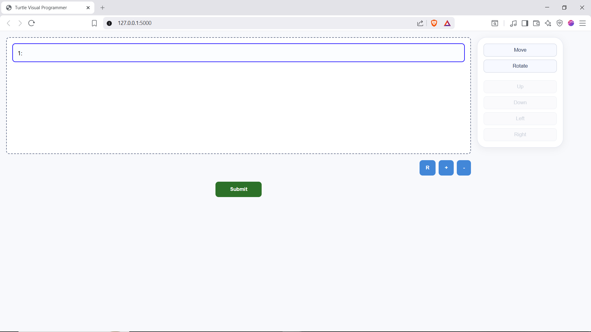
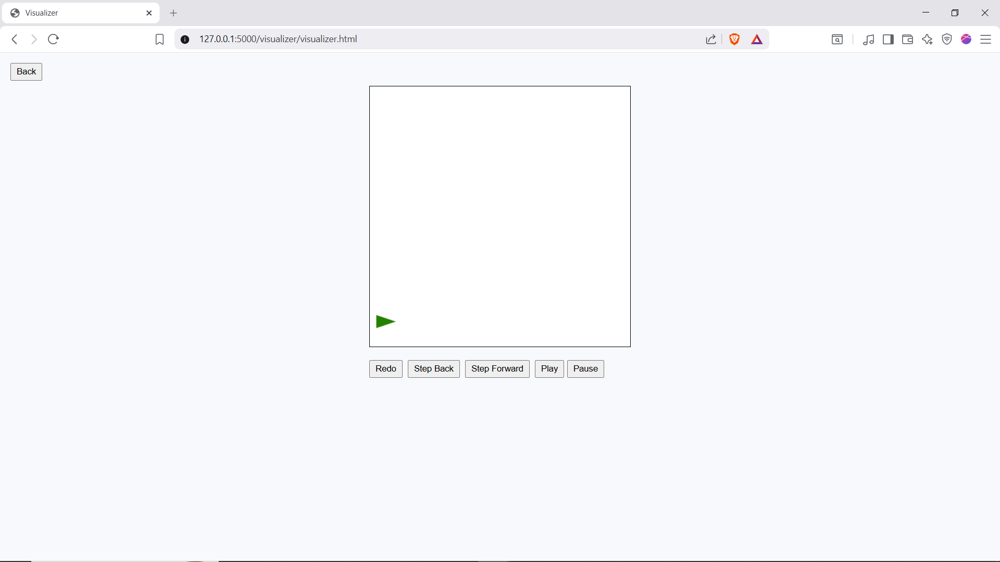

A full-stack web application that allows users to build programs for a turtle using visual instructions, which the app then interprets, and executes as a digital simulation.

## Prerequisites
You'll need:
- Python 3.10 or later
- npm

## Running the App
1. Navigate to the root folder of the project
2. Download the backend requirements with `pip install -r requirements.txt`
3. Download the frontend requirements with `npm install`
4. Run the server by running `python -m src.backend.app`
5. You can now view the site in your browser on the page "http://127.0.0.1:5000/" It should look like this:

6. Create an instruction using the block palette on the right-hand side
7. Add slots for more instructions using the "+" button
8. Once you're satisfied with your program, click "Submit"
This will redirect you to a second page where you can view your program's execution as an animation like:

## Tech Stack
- Frontend: Vanilla JS, HTML, CSS, HTML Canvas
- Backend: Python, Flask
- Testing:
    - Frontend: Jest
    - Backend: Unittest, Pytest

## Architecture
This project was made to focus on a clean separation of concerns. The flow of information goes from layer to layer, those being:
User input -> Instructions (Frontend) -> JSON -> JSON Parser -> Instructions (Backend) -> Actions -> Runner -> Turtle State Trace -> Animation

### User Input
The user can create a *program* made up of *instructions* which has a type and a *direction*. Currently, there are only two instruction types: "Move" and "Rotate" and four directions: "Up", "Down", "Left", and "Right". Instructions can be made through the UI, found in the `frontend/` folder.

### Instruction (Frontend)
An "Instruction" class exists both in the frontend and the backend. Both represent the user intent, what the user wants to happen. On the frontend, those Instructions are translated to structured JSON and then passed to the backend.
The code for this is found in the `src/frontend/model/` folder

### JSON and JSON Parser
The passed JSON is recieved by a Flask endpoint, validated, and parsed into an instance of `BlockInstruction`, which contains a list of `Instructions`.
The route and endpoint is in `src/backend/api/` and the parser is in `src/backend/parser/`

### Instruction (Backend)
This instruction class has sub-classes based on the type of Instruction.
It's code exists in `src/backend/instruction/` folder

### Action
Actions encapsulate the actual behavior caused by a given instruction.
It's found in `src/backend/action/`

### Runner
The runner is responsible for executing the user-created program. It holds the contextual state of the turtle and all of the actions done upon it, which it then executes one by one, updating the context and recording that change.
That's in `src/backend/runner/`

### State Trace
The *state trace* is the aformentioned record of the changes to the turtle, specifically, it records its x and y position, along with the direction its facing

### Animation
The state trace is then rendered as an animation using HTML Canvas.
The code for it can be found in `src/frontend/visualizer`